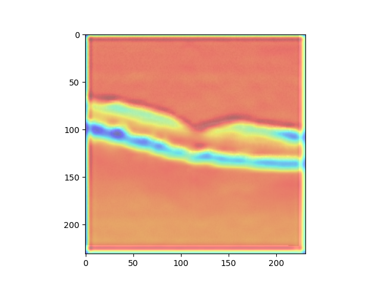

===================================
Reporting Prediction Results
===================================

This task is called on the local machine in the main environment. It will get the prediction results from the test task
and it will report some simple statistics and saves a salted figure. Please not this is a very simple and generic report
and is not a contribution of this project. The project aims to build a reproducible and simple to use pipline for ML
projects of this type.

.. code-block::

    class PlotResults(Task):
        """Luigi task that uses prediction and saves plots"""

        __version__ = "1.0"

        data_source = Parameter()
        output_pred = Parameter()
        output_model = Parameter()
        train_loc = Parameter()

        requires = Requires()
        req_1 = Requirement(ConvNeuralTest)
        LOCAL_ROOT = os.path.join(os.getcwd(), "data")

        path = os.path.join(LOCAL_ROOT, "{task.__class__.__name__}-{salt}.png")

        output = TargetOutput(
            file_pattern=path, target_class=SuffixPreservingLocalTarget, ext=""
        )

        def run(self):
            """
            Function that loads the prediction and call the show_cam plotting method
            """
            features = np.load(self.req_1.output().path)
            test_path = self.req_1.output().path.rstrip("features.npy")
            results = np.load(test_path + "results.npy")
            gap_weights_l = np.load(test_path + "gap_weights_l.npy", allow_pickle=True)
            test_image = np.load(test_path + "image.npy")

            show_cam(gap_weights_l, results, features, test_image, self.output().path)

