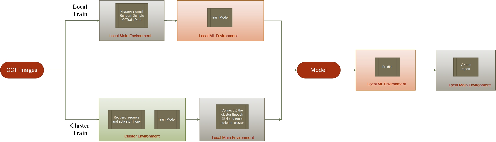

=====================
Project Structure
=====================

The directed acyclic graph (DAG) of the project can be seen in the image above. User can select a local model training
for development purposes or a cluster training where the model will be built on a remote machine with GPU. Based on
this selection, Luigi will trigger different tasks to build the model or bring the model from the cluster machine.
Once the model is built, it will be used on the local machine for prediction and the output of the prediction will be
used in another task to generate reports and plots.

The code will be run in different Pyhton environments as shown in the graph to avoid the dependency hell as described
in the Introduction section.