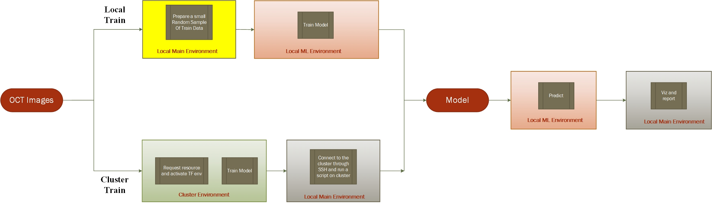

===================================
Training The Model
===================================

Local Train
===========================

This path on the graph is used for train code development purposes only. Local Model Training starts with a Luigi
external target to output the OCT images. Because there are around 80,000 images in the train set, another Luigi task
is called to take a small random sample of the images from different classes.

.. code-block::
    class LocalImageReduced(Task):
    """Luigi external task that returns a target for a small subset of train data"""

    __version__ = "1.0"

    requires = Requires()
    req_1 = Requirement(LocalImage)
    LOCAL_ROOT = os.path.join(os.getcwd(), "data")
    LOCAL_IMAGE = os.path.join(LOCAL_ROOT, "OCTReduced")

    output = TargetOutput(
        file_pattern=LOCAL_IMAGE, target_class=SuffixPreservingLocalTarget, ext=""
    )

    def run(self):
        """
        This function goes through the train/test directories and the subdirectories inside for each class and takes
        a small sample of images and copies them into a new directory.
        """
        rootdir = self.req_1.output().path
        newpath = self.output().path
        for src_dir, dirs, files in os.walk(rootdir):
            dst_dir = src_dir.replace(rootdir, newpath, 1)
            if not os.path.exists(dst_dir):
                os.makedirs(dst_dir)
            counter = 0
            for file_ in files:
                src_file = os.path.join(src_dir, file_)
                shutil.copy(src_file, dst_dir)
                counter += 1
                if "train" in dst_dir and counter > 50:
                    break
                elif "test" in dst_dir and counter > 10:
                    break

